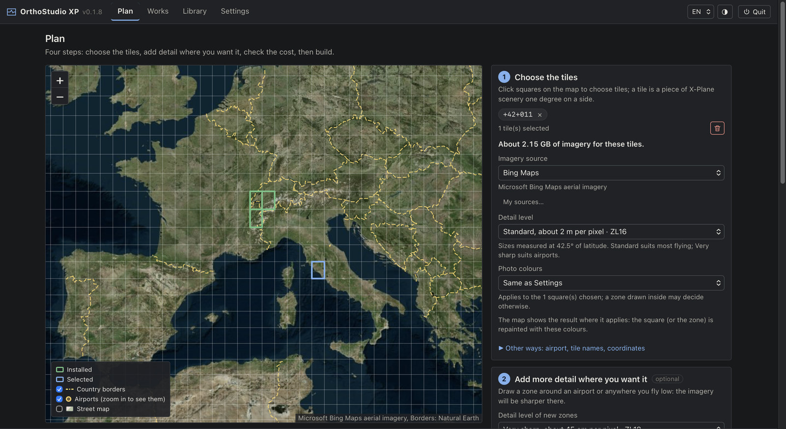
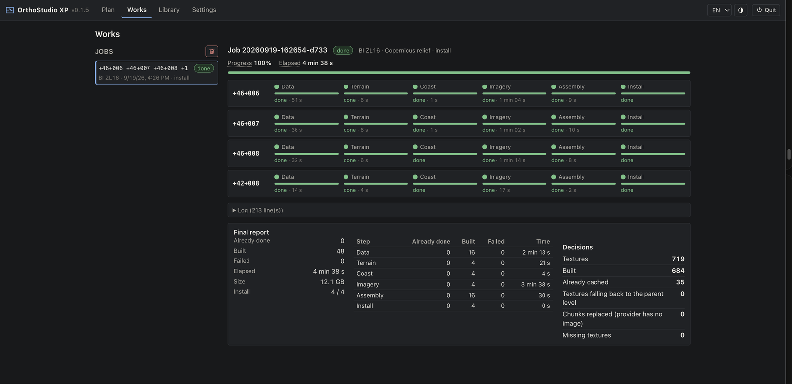
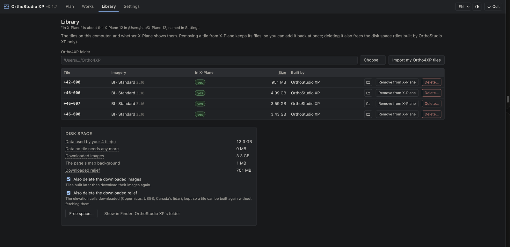
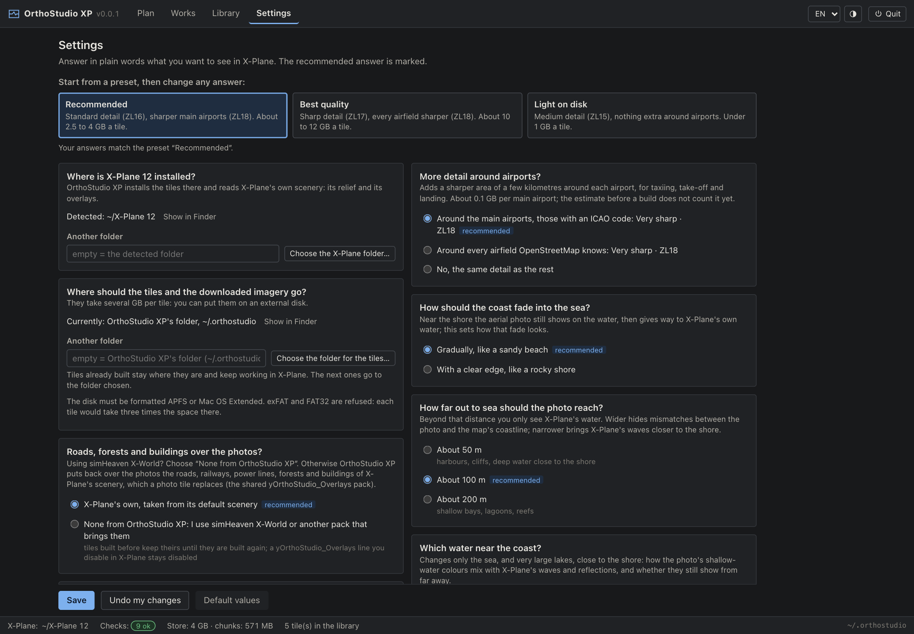

# OrthoStudio XP

Orthophoto scenery for X-Plane 12 (XP12): aerial imagery laid on the real relief, tile by tile,
built from a page that says in plain words what it is doing. OrthoStudio XP is a new program built
on the rules of [Ortho4XP](https://github.com/oscarpilote/Ortho4XP), which Oscar Pilote and its
contributors have refined for ten years: it makes the same kind of tiles, with a different
architecture that builds them faster. It would not exist without Ortho4XP.

**Status: beta.** OrthoStudio XP builds and installs tiles end to end on macOS (Apple Silicon),
and on Windows with its installer (tried on Windows 11 on ARM, where the x64 app runs under
emulation, more slowly; not yet on a PC with an Intel or AMD processor). Its Linux installer is
built and checked automatically, but nobody has built a tile with it yet; a first try on Linux will
probably come later. The installer for Intel Macs is built and checked automatically too, on an
Apple Silicon Mac under Rosetta, where it also runs; nobody has tried it on an Intel Mac yet.



## What you get

- **A page with a map.** Click the squares you want, see the tiles already in X-Plane, draw
  sharper zones around airports or anywhere you fly low (one zone may cover several tiles),
  check the size and the time before building, then build and install in one click.
- **Works, as it happens.** A progress bar for every step of every tile, the time elapsed and
  a range for the time left over the whole build (starting from your connection's speed on your
  last builds), errors that say what happened and what to do, and a button to fetch again only
  what is missing. Start more builds while one runs: they wait in a queue, and a tile being built
  cannot be chosen twice.
- **Settings in plain words.** Questions about what you want to see in X-Plane (detail, airports,
  coast, water, relief, roads and forests), the recommended answer marked, three presets, and every
  Ortho4XP setting still there under "For experts" with a plain label.
- **A Library.** Every tile on the computer, its size, whether X-Plane shows it; remove a tile from
  X-Plane and add it back at once, or delete it; see what the cache and the downloaded images take
  and free that space in one click. Tiles imported from Ortho4XP are listed too, and OrthoStudio XP
  never deletes them. A button shows a tile's folder in the Finder, the Windows File Explorer or the
  Linux file manager.
- **Installation handled.** Links in Custom Scenery under OrthoStudio XP's own names
  (`zOrthoStudio_<tile>`, `yOrthoStudio_Overlays`), `scenery_packs.ini` in the right order, a
  backup of the original, overlays kept in step with their tiles, or left out when simHeaven
  X-World brings its own.
- **Relief from X-Plane 12 itself.** No elevation download that can fail and leave a flat tile.
  For a finer mesh, Settings can take the Copernicus relief (1 arc-second, downloaded and kept),
  the USGS 3DEP over the United States (1/3 arc-second, about 10 m, ~400 MB a square), Canada's
  lidar where it has been flown (bare earth, laid over Copernicus, which answers elsewhere) or
  your own elevation file. Outside a source's coverage the tile is refused, never built flat.
- **The colours of the photos.** Aerial imagery as the source delivers it, or toned down a little
  or a lot, or by your own brightness, contrast and colour. It is applied when the textures are
  encoded, so changing your mind rebuilds the tile without downloading anything again.
- **Hand-made mesh patches.** Point Settings at a folder of `*.patch.osm` files written with JOSM
  and the tiles that have one are built with it: the patches their authors publish for Ortho4XP fit
  as they are, in the tree they come in.
- **A cache.** Every step's result is kept under a fingerprint of what produced it: an unchanged
  tile builds again in a second, a new zone rebuilds only what it touches, and imagery is never
  downloaded twice. `osxp clean --all` gives the space back when you want it.
- **Your disk of choice.** The tiles, the cache and the downloaded imagery can go to a folder on an
  external disk, chosen in Settings; an unplugged disk is said as such, and nothing is written in
  its place on the computer's own disk.

How it works, what it keeps on disk and how to clean it:
[docs/how-it-works.md](docs/how-it-works.md).

| Works | Library | Settings |
|---|---|---|
|  |  |  |

## Build times, measured

Same machine (Apple M4 Pro), same tiles, same imagery. Every figure comes from a measurement in
[docs/benchmarks/](docs/benchmarks/). Ortho4XP here is its current code, the master branch of its
GitHub repository at commit `26ec00a` (March 2026), which its author describes as in transition
to 1.40; its last release is 1.31. The measurements were made on a Mac, where Ortho4XP's texture
compression tool runs under Rosetta; on Windows and Linux that tool runs natively, and the gap in
compression would be smaller.

| | Ortho4XP | OrthoStudio XP |
|---|---:|---:|
| Build a tile again with nothing changed (Marseille, ZL14) | 63.2 s | **0.3 s** |
| Build a tile built once at ZL14 again at ZL16 | 250.7 s | **33.1 s** |
| Imagery of a ZL16 tile, nothing cached (179 textures) | 206.9 s | **34.6 s** |
| Roads, water, coast and airports of a tile | 31.8 s | **6.6 s** |
| Relief mesh / water masks of a tile | 8.5 s / 4.7 s | **2.8 s / 0.8 s** |
| Download rate from Bing | 219 requests/s | **1,436 requests/s** |
| Compressing one texture | 1.15 s (x86 tool under Rosetta) | **0.33 s** (native, all cores) |

### A real build

Six ZL16 tiles around Lake Geneva and the Alps, built and installed from the page on an M4 Pro:
1,347 textures, 321,792 image pieces, 4.64 GB, every image downloaded. **5 min 22 s**, no error,
no retry. The home connection was used at 16.5 MB/s (132 Mbit/s) on average, 99 to 162 Mbit/s
depending on the tile. No elevation file to download (the relief comes from X-Plane 12), and a
stalled image piece is asked for again instead of costing the tile. For scale, Ortho4XP took
250.7 s for a single ZL16 tile with its caches warm, which would make about 25 minutes for six
tiles built one after the other. Details:
[docs/benchmarks/batch-6-tiles-zl16.md](docs/benchmarks/batch-6-tiles-zl16.md).

Where the time goes: in these measurements Ortho4XP runs its steps one after the other, on 1.8
of the 14 cores on average for a tile built again. It keeps its downloads (map data, elevation,
images) and the files of the last build, and you choose which steps to run again; a step run again
is computed in full. OrthoStudio XP runs the steps of all the tiles as a graph over every core,
downloads over HTTP/2 with up to 128 requests in flight, compresses textures in-process, and files
every result under what produced it: it finds by itself the steps whose inputs did not change, and
does not run them again.

Other differences in use:

| | Ortho4XP | OrthoStudio XP |
|---|---|---|
| Settings | 57 parameters in its configuration window, named as in its code | questions in plain words, three presets, every parameter still under "For experts" |
| Errors | messages in its log | coded errors with a remedy, on the step that failed |
| An image piece that does not arrive | tried at a lower zoom level, then filled with white, and said in the log | asked for again after a pause, from another server; a tile still missing some is not installed |
| Progress | a bar per step of the tile being built, and the log | a bar per step of every tile, the whole build's progress and time left |
| Installation | a link created from its tile map (Ctrl+click); the order in `scenery_packs.ini` is left to X-Plane and to you | from the page in one click, in the order X-Plane needs, with a backup, reversible |
| Several tiles | built one after the other (batch build) | built side by side, with sharper zones spanning tiles |

Ortho4XP remains the reference, and does things OrthoStudio XP does not do yet: colour filters for
the imagery (its `.flt` files) and the mesh patches made by hand (its `Patches` folder). It has also
been used for years by a large community on Windows, Linux and macOS, where OrthoStudio XP is a beta
whose tiles have been built on macOS and Windows so far.

## Getting started

Requirements: X-Plane 12, and macOS 14 or later on Apple Silicon (macOS 15 or later on an Intel
Mac), Windows 10 or 11 (64-bit) or a
64-bit Linux. Download the installer of your system from the releases of this repository; each has
Python inside.

- **macOS**: open `OrthoStudio-XP-<version>-macos-arm64.dmg` on Apple Silicon, or
  `OrthoStudio-XP-<version>-macos-x86_64.dmg` on an Intel Mac, and drag *OrthoStudio XP* to
  Applications. The app is not signed yet, so macOS refuses to open it the first time: open
  *System Settings*, *Privacy & Security*, click *Open Anyway* next to OrthoStudio XP and confirm.
  If macOS says instead that the app is damaged, run this once in the Terminal:
  `xattr -dr com.apple.quarantine "/Applications/OrthoStudio XP.app"`.
- **Windows**: run `OrthoStudio-XP-<version>-windows-x64-setup.exe`. Not signed yet either: in the
  *Windows protected your PC* window, click *More info*, then *Run anyway*. It installs for your
  user alone, without administrator rights, and adds OrthoStudio XP to the Start menu.
- **Linux**: extract `OrthoStudio-XP-<version>-linux-x86_64.tar.gz` where you want to keep it, then
  run `./install.sh` in the extracted folder for an entry in the applications menu, or start
  `./orthostudio-xp` directly.

Opening OrthoStudio XP starts it and opens its page in your browser, or just the page when it
already runs; *Quit* in the page stops it, and it stops by itself five minutes after its last page
is closed, unless a build is running or waiting. Its messages go to `serve.log`, in
`~/Library/Logs/OrthoStudio XP` (macOS), `%LOCALAPPDATA%\OrthoStudio XP\Logs` (Windows) or
`~/.local/state/OrthoStudio XP/log` (Linux). Your tiles and settings stay in `~/.orthostudio` (the
tiles in the data folder chosen in Settings, if you chose one) when the app is removed.

OrthoStudio XP works with the X-Plane 12 of the same computer: it takes the relief, roads, forests
and buildings from X-Plane's scenery and adds the tiles to its Custom Scenery. It finds X-Plane by
itself; when it cannot (X-Plane in an unusual folder, or a virtual machine whose X-Plane is on the
host), step 3 of the Plan says so, and its button opens the Settings question where you choose
the folder.

### From the source

Requirements: Python 3.12 or later, [uv](https://docs.astral.sh/uv/), CMake and a C compiler.

```bash
git clone <this repository> orthostudio-xp
cd orthostudio-xp
uv sync --all-extras --all-groups
cmake -S native/triangle4xp -B native/triangle4xp/build -DCMAKE_BUILD_TYPE=Release
cmake --build native/triangle4xp/build --config Release
uv run osxp doctor          # checks Python, the encoder, the network client, X-Plane, the disk
uv run osxp serve --open    # the page, at http://127.0.0.1:8641
```

On macOS, `uv run python tools/package/checkout_app.py` makes `dist/OrthoStudio XP.app`, an app
that runs this checkout. `uv run python tools/package/build.py --check` builds and checks the
installer of the system it runs on (`docs/specs/packaging.md`).

Quit X-Plane before installing or removing tiles: OrthoStudio XP refuses to change the scenery while
it runs.

The same from a terminal, where `osxp` is the short name of the `orthostudio` command:

```bash
uv run osxp plan --tile +46+006                 # size and time before building
uv run osxp build --tile +46+006 --install      # build and install
uv run osxp library                             # the tiles OrthoStudio XP knows
uv run osxp uninstall +46+006                   # out of X-Plane, files kept
uv run osxp uninstall +46+006 --delete          # deleted for good
uv run osxp clean --all                         # give back all the space OrthoStudio XP can
```

## Reporting a problem

Open an issue in this repository ([New issue](https://github.com/radioharris/orthostudio-xp/issues/new/choose)):
its form asks for what helps find the cause, that is the version, your system, what you did and
what you saw, the tile, a screenshot, and the log `serve.log`. Without a GitHub account, the
comments on OrthoStudio XP's page on X-Plane.Org are read too.

## Imagery and responsible use

OrthoStudio XP downloads imagery from public map services for your personal use in X-Plane, as
Ortho4XP does. Their terms of use apply to you; many forbid redistributing the imagery. Do not share
or sell tiles built from them. You can add a source OrthoStudio XP does not ship (*My sources…* in
the Plan): you add it yourself, and its terms apply to you as well.

## Relationship to Ortho4XP and licences

OrthoStudio XP ports the X-Plane domain rules of Ortho4XP (coastlines, airports, masks, DSF
encoding, provider definitions) into a new architecture. It is therefore a derivative work and is
licensed under the GPL v3, like Ortho4XP. Thanks to Oscar Pilote and the Ortho4XP contributors for
ten years of work on those rules. OrthoStudio XP does not need Ortho4XP: it never imports, runs or
reads it, and includes none of its files apart from two small data images (`world_tiles.png`,
`water_transition.png`) and the two programs below. The one link left is the import of the tiles
an Ortho4XP folder built, so they can be installed and removed from the Library (decision 0010).

Triangle4XP (Jonathan Shewchuk's Triangle, modified by Oscar Pilote) stays a separate program,
distributed free of charge with its sources and a notice of its modifications, as its licence
requires: see `native/triangle4xp/`. Its licence forbids including it in a commercial product
without the author's agreement.

DSFTool (Laminar Research's X-Plane Scenery Tools, MIT/X11 licence) extracts the overlays: its
macOS, Windows and Linux binaries are in `native/dsftool/`, with their checksums.

Map data © [OpenStreetMap contributors](https://www.openstreetmap.org/copyright), under the Open
Database Licence (ODbL): OrthoStudio XP downloads the airports, roads, coastline and water of each
tile from public Overpass servers to shape its terrain. Like the imagery, the tiles built from them
are for your own use.

Base-map borders: Natural Earth (public domain). Map library: Leaflet (BSD-2-Clause).

## Development

```bash
uv sync --all-extras --all-groups
uv run pytest -n 8 -m "not network"   # the suite, in parallel
uv run ruff check .
uv run mypy src
```

Tests marked `xplane` read the local X-Plane 12 install (never write to it) and skip without it.
Network tests (`-m network`) are never run in CI. No test needs Ortho4XP.

## Layout

```
src/orthostudio/  the package: graph and store, network, sources, vectors, mesh, masks,
                  imagery and textures, DSF, packs, install, API, web page (ui/), CLI
native/           Triangle4XP sources and build, DSFTool binaries
docs/how-it-works.md   the user's guide to what OrthoStudio XP does and keeps
docs/decisions/   architecture decision records
docs/specs/       behaviour specifications, written before each ported rule
docs/benchmarks/  the measurements behind each design choice
tools/            network benchmarks, borders data, the installers (package/)
tests/
```
