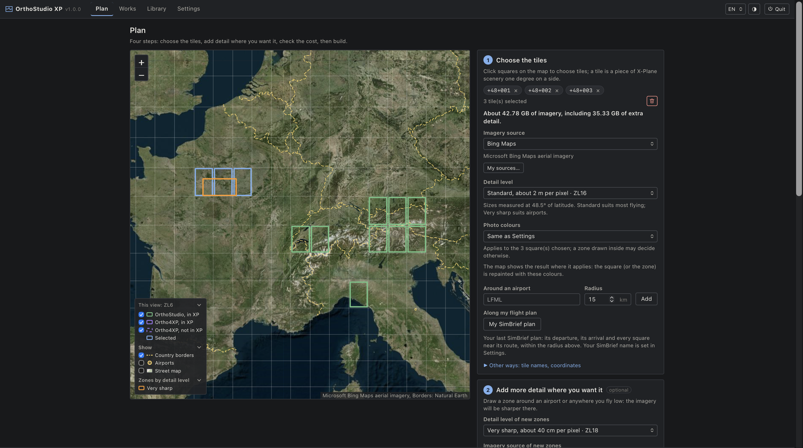
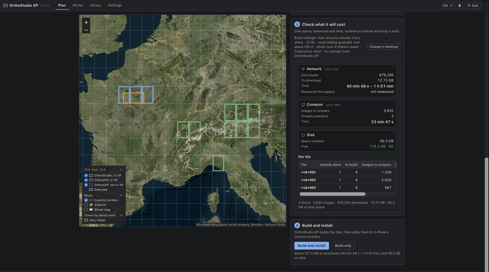
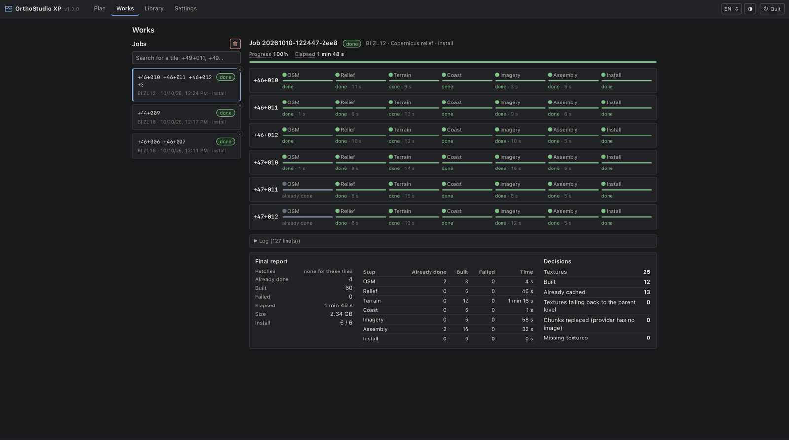
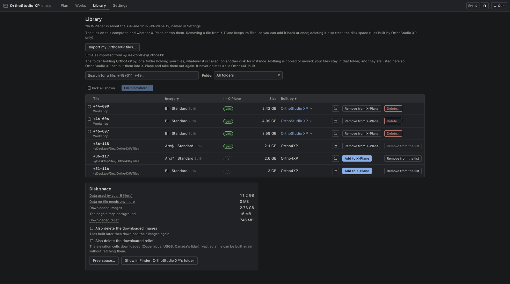
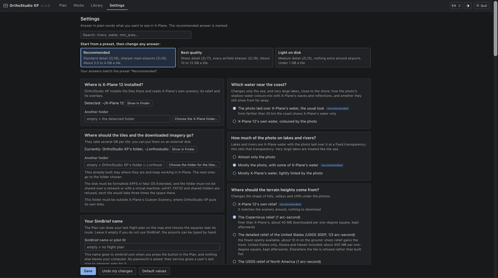

# OrthoStudio XP

Orthophoto scenery for X-Plane 12 (XP12): aerial imagery laid on the real relief, tile by tile,
built from a page that says in plain words what it is doing. OrthoStudio XP is a new program built
on the rules of [Ortho4XP](https://github.com/oscarpilote/Ortho4XP), which Oscar Pilote and its
contributors have refined for ten years: it makes the same kind of tiles, with a different
architecture that builds them faster. It would not exist without Ortho4XP.

**Status: 1.0, the first stable version.** OrthoStudio XP builds and installs tiles end to end on
macOS and Windows, with their installers. The installers for Intel Macs and for Linux are built and
checked automatically at every release, and downloaded far less often than the others; Linux is
experimental.



## What you get

- **A map to choose from.** Click the squares you want or draw a rectangle over them, and draw
  sharper zones around airports or where you fly low. It shows the aerial imagery or the street
  map, the airports with their ICAO codes, the tiles you already have, and what the view is worth
  on the ground in the zoom levels a build works in.
- **The cost before you build**: disk space, download and time, then build and install in one
  click.
- **Works, as it happens.** A bar for every step of every tile, the time left, errors that say what
  happened and what to do, and a button to fetch again only what is missing. Builds queue up, up to
  500 tiles each.
- **Settings in plain words.** Questions about what you want to see in X-Plane, three presets, and
  every Ortho4XP setting under "For experts" with a plain label.
- **A Library.** Every tile on the computer, its size, whether X-Plane shows it and what it was
  built with, searched, sorted and opened in its folder. Take a tile out of X-Plane and back,
  delete it, file it on any disk ([docs/workshop.md](docs/workshop.md)), and free the space the
  cache takes. Tiles built with Ortho4XP are listed too, and never deleted.
- **Installation handled.** Each tile goes into Custom Scenery in the order X-Plane needs, with its
  roads, forests and buildings (left out when simHeaven X-World brings its own) and a backup of
  `scenery_packs.ini`.
- **Map data in seconds.** The airports, roads, coastline and water of every tile of the planet
  come from OrthoStudio XP's own library (OpenStreetMap as of 7 October 2026, updated regularly),
  and from the public Overpass servers when the library cannot answer.
- **Relief from X-Plane 12 itself**, nothing to download, or a finer one: Copernicus, the USGS
  over North America, Canada's lidar, ANADEM over South America, or your own elevation files at
  their own resolution. Works says which relief a build actually read, and a tile outside a
  source's coverage is refused, never built flat.
- **The colours of the photos, seen on the map**: as delivered, toned down, or by your own numbers,
  for everything, one square or one zone. Changing them builds a tile again without downloading
  anything.
- **The grain of the ground.** One of X-Plane 12's decals over the photos, the one you choose;
  turning it on, off or to another writes a tile's terrain files again, and nothing else.
- **The squares of a flight plan.** Your last SimBrief plan chooses the squares along its route,
  within the radius you set.
- **Hand-made mesh patches**, those published for Ortho4XP included, read as they come.
- **A cache.** An unchanged tile builds again in seconds, a new zone builds again only what it
  touches, and imagery is never downloaded twice.
- **Your disk of choice.** Tiles are built in the workshop, the data folder chosen in Settings, then
  filed wherever you want; an unplugged disk is said as such, and nothing is written in its place.
- **Text as large as you need.** `− 100 % +` zooms the whole page and `Aa` makes the text alone
  larger; the window opens where you left it.

How it works, what it keeps on disk and how to clean it:
[docs/how-it-works.md](docs/how-it-works.md).

| What it will cost | Works |
|---|---|
|  |  |

| Library | Settings |
|---|---|
|  |  |

## Build times, measured

Same machine (Apple M4 Pro), same tiles, same imagery. Every figure comes from a measurement in
[docs/benchmarks/](docs/benchmarks/). Ortho4XP here is its current code, the master branch of its
GitHub repository at commit `26ec00a` (March 2026), which its author describes as in transition
to 1.40; its last release is 1.31. The measurements were made on a Mac, where Ortho4XP's texture
compression tool runs under Rosetta; on Windows and Linux that tool runs natively, and the gap in
compression would be smaller.

| | Ortho4XP | OrthoStudio XP |
|---|---:|---:|
| Build a tile again with nothing changed (Marseille, ZL14) | 63.2 s | **0.3 s** |
| Build a tile built once at ZL14 again at ZL16 | 250.7 s | **33.1 s** |
| Imagery of a ZL16 tile, nothing cached (179 textures) | 206.9 s | **34.6 s** |
| Roads, water, coast and airports of a tile | 31.8 s | **6.6 s** |
| Relief mesh / water masks of a tile | 8.5 s / 4.7 s | **2.8 s / 0.8 s** |
| Download rate from Bing | 219 requests/s | **1,436 requests/s** |
| Compressing one texture | 1.15 s (x86 tool under Rosetta) | **0.33 s** (native, all cores) |

### A real build

Six ZL16 tiles around Lake Geneva and the Alps, built and installed from the page on an M4 Pro:
1,347 textures, 321,792 image pieces, 4.64 GB, every image downloaded. **5 min 22 s**, no error,
no retry. The home connection was used at 16.5 MB/s (132 Mbit/s) on average, 99 to 162 Mbit/s
depending on the tile. No elevation file to download (the relief comes from X-Plane 12), and a
stalled image piece is asked for again instead of costing the tile. For scale, Ortho4XP took
250.7 s for a single ZL16 tile with its caches warm, which would make about 25 minutes for six
tiles built one after the other. Details:
[docs/benchmarks/batch-6-tiles-zl16.md](docs/benchmarks/batch-6-tiles-zl16.md).

Where the time goes: in these measurements Ortho4XP runs its steps one after the other, on 1.8
of the 14 cores on average for a tile built again. It keeps its downloads (map data, elevation,
images) and the files of the last build, and you choose which steps to run again; a step run again
is computed in full. OrthoStudio XP runs the steps of all the tiles as a graph over every core,
downloads over HTTP/2 with up to 128 requests in flight, compresses textures in-process, and files
every result under what produced it: it finds by itself the steps whose inputs did not change, and
does not run them again.

Other differences in use:

| | Ortho4XP | OrthoStudio XP |
|---|---|---|
| Settings | 57 parameters in its configuration window, named as in its code | questions in plain words, three presets, every parameter still under "For experts" |
| Errors | messages in its log | coded errors with a remedy, on the step that failed |
| An image piece that does not arrive | tried at a lower zoom level, then filled with white, and said in the log | asked for again after a pause, from another server; a tile still missing some is not installed |
| Progress | a bar per step of the tile being built, and the log | a bar per step of every tile, the whole build's progress and time left |
| Installation | a link created from its tile map (Ctrl+click); the order in `scenery_packs.ini` is left to X-Plane and to you | from the page in one click, in the order X-Plane needs, with a backup, reversible |
| Several tiles | built one after the other (batch build) | built side by side, with sharper zones spanning tiles |

Ortho4XP remains the reference, and does things OrthoStudio XP does not do:

- **many more imagery sources**: 71 definitions, mostly national, against 13 checked ones here (a
  source of your own can be added in the page), and a **combined** layer that stitches several of
  them into a single texture, each with its own extent, priority and colour filter — where
  OrthoStudio XP uses one source per tile, or per zone drawn inside it;
- **a richer treatment of the imagery**: sharpness, blur and per-channel levels with gamma, beside
  the brightness, contrast and colour OrthoStudio XP applies when it encodes the textures;
- **X-Plane 11** as well, where OrthoStudio XP builds for X-Plane 12 only.

Its colour filters (`.flt`) and its hand-made mesh patches (`Patches`) are here since 0.1.3 and
0.1.4: patches written for Ortho4XP are read as they are, and the colours are set for everything
you build, for one square, or for a zone. Ortho4XP has also been used for years by a large
community on Windows, Linux and macOS; OrthoStudio XP's first version came out in September 2026.

## Getting started

Requirements: X-Plane 12, and macOS 14 or later on Apple Silicon (macOS 15 or later on an Intel
Mac), Windows 10 or 11 (64-bit) or a
64-bit Linux. Download the installer of your system from the releases of this repository; each has
Python inside.

- **macOS**: open `OrthoStudio-XP-<version>-macos-arm64.dmg` on Apple Silicon, or
  `OrthoStudio-XP-<version>-macos-x86_64.dmg` on an Intel Mac, and drag *OrthoStudio XP* to
  Applications. The app is not signed yet, so macOS refuses to open it the first time: open
  *System Settings*, *Privacy & Security*, click *Open Anyway* next to OrthoStudio XP and confirm.
  If macOS says instead that the app is damaged, run this once in the Terminal:
  `xattr -dr com.apple.quarantine "/Applications/OrthoStudio XP.app"`.
- **Windows**: run `OrthoStudio-XP-<version>-windows-x64-setup.exe`. Not signed yet either: in the
  *Windows protected your PC* window, click *More info*, then *Run anyway*. It installs for your
  user alone, without administrator rights, and adds OrthoStudio XP to the Start menu. Its window
  is drawn by Microsoft's WebView2 Runtime: the installer offers it when the PC lacks it, and offers
  to update it when the PC's is too old (before version 101, of 2022), which Windows lets through
  only with an administrator's permission. Turned down, OrthoStudio XP opens in your browser.
- **Linux**: extract `OrthoStudio-XP-<version>-linux-x86_64.tar.gz` where you want to keep it, then
  run `./install.sh` in the extracted folder for an entry in the applications menu, or start
  `./orthostudio-xp` directly.

Opening OrthoStudio XP shows its page in a window of its own, which works like any window on your
system; opening it again brings that window back. It keeps a browser's habits: Cmd+F or Ctrl+F
finds text on the page, and Cmd or Ctrl with `+`, `-` and `0` changes the text size, which it
remembers. When a newer version is out, a line at the top of the page says so, with a link to its
release page: nothing is downloaded or installed, GitHub is asked once a day at most, and Settings
can turn it off. Quitting stops the engine, and asks first when a
build is running: what was already built is kept, so building again carries on from there. On
Linux it opens in your browser instead, as every version has: the web view a window needs there is
built for your distribution's own Python, and OrthoStudio XP carries its own, so installing it
would change nothing. In a browser it stops by itself five minutes after the last page is closed,
with no build running or waiting. What it does, stage by stage, and how long each start took go
to `serve.log`, in
`~/Library/Logs/OrthoStudio XP` (macOS), `%LOCALAPPDATA%\OrthoStudio XP\Logs` (Windows) or
`~/.orthostudio/log` (Linux, beside the rest of what it keeps). Your tiles and settings stay in `~/.orthostudio` (the
tiles in the data folder chosen in Settings, if you chose one) when the app is removed.

OrthoStudio XP runs entirely on your computer: its screens are a page it serves itself, at
127.0.0.1, shown in a window of its own. Nothing goes through a server of ours, and its downloads
from the imagery, map and elevation services go over HTTPS, except a source you add yourself with
an `http://` address. Opened in a browser instead, the page may be called "not secure" because it
is not HTTPS, which is harmless here: it never leaves your computer.

An antivirus with a behaviour-based ransomware protection (Trend Micro's, for one) may take a build
for ransomware and stop it: a build writes thousands of files in a few minutes, compressed
textures that look as random as encrypted files do, replaces files by writing new ones, and adds
links and a line to `scenery_packs.ini` in X-Plane's folder. If yours does, allow OrthoStudio XP
in its settings: the program is in `%LOCALAPPDATA%\Programs\OrthoStudio XP` on Windows, and its
data in `.orthostudio` in your user folder (or the data folder chosen in Settings).

OrthoStudio XP works with the X-Plane 12 of the same computer: it takes the relief, roads, forests
and buildings from X-Plane's scenery and adds the tiles to its Custom Scenery. The part of the
world you build must be installed in X-Plane 12, whose installer lets you choose which parts: step
3 of the Plan says when a square's is not. The regions of X-Plane's demo (Maui to Kauai, the coast
of Oregon and Washington, south-east Alaska), which its installer keeps in `X-Plane 12 Demo Areas`,
are read there. It finds X-Plane by
itself; when it cannot (X-Plane in an unusual folder, or a virtual machine whose X-Plane is on the
host), step 3 of the Plan says so, and its button opens the Settings question where you choose
the folder.

### From the source

Requirements: Python 3.12 or later, [uv](https://docs.astral.sh/uv/), CMake and a C compiler.

```bash
git clone <this repository> orthostudio-xp
cd orthostudio-xp
uv sync --all-extras --all-groups
cmake -S native/triangle4xp -B native/triangle4xp/build -DCMAKE_BUILD_TYPE=Release
cmake --build native/triangle4xp/build --config Release
uv run osxp doctor          # checks Python, the encoder, the network client, X-Plane, the disk
uv run osxp serve --open    # the page, at http://127.0.0.1:8641
```

On macOS, `uv run python tools/package/checkout_app.py` makes `dist/OrthoStudio XP.app`, an app
that runs this checkout. `uv run python tools/package/build.py --check` builds and checks the
installer of the system it runs on (`docs/specs/packaging.md`).

Started again while it runs, OrthoStudio XP shows the running one, unless the code changed in
between (a pull, another branch, an edit): the one started before is then stopped and the new
code starts, a build running in it excepted.

Quit X-Plane before installing or removing tiles: OrthoStudio XP refuses to change the scenery while
it runs.

The same from a terminal, where `osxp` is the short name of the `orthostudio` command:

```bash
uv run osxp plan --tile +46+006                 # size and time before building
uv run osxp build --tile +46+006 --install      # build and install
uv run osxp library                             # the tiles OrthoStudio XP knows
uv run osxp uninstall +46+006                   # out of X-Plane, files kept
uv run osxp uninstall +46+006 --delete          # deleted for good
uv run osxp clean --all                         # give back all the space OrthoStudio XP can
```

## Reporting a problem, asking for a feature

- **A problem**: open an issue in this repository
  ([New issue](https://github.com/radioharris/orthostudio-xp/issues/new/choose)). Its form asks for
  what helps find the cause: the version, your system, what you did and what you saw, the tile, a
  screenshot, and the log `serve.log`. The issues are kept for what goes wrong.
- **An idea or a request**: start a discussion in
  [Ideas](https://github.com/radioharris/orthostudio-xp/discussions/categories/ideas). Its form asks
  what you would like, why, how you do it today, and examples. Others can vote for it and add what
  they need, so the ideas with the most votes are the roadmap's starting point.
- **A question**: ask it in
  [Q&A](https://github.com/radioharris/orthostudio-xp/discussions/categories/q-a).

Without a GitHub account, the comments on OrthoStudio XP's page on X-Plane.Org are read too.

## Imagery and responsible use

OrthoStudio XP downloads imagery from public map services for your personal use in X-Plane, as
Ortho4XP does. Their terms of use apply to you; many forbid redistributing the imagery. Do not share
or sell tiles built from them. You can add a source OrthoStudio XP does not ship (*My sources…* in
the Plan): you add it yourself, and its terms apply to you as well.

## Relationship to Ortho4XP and licences

OrthoStudio XP is Copyright (C) 2026 radioharris, licensed under the GNU GPL v3 or later (`LICENSE`,
`NOTICE`). `NOTICE` adds three terms that section 7 of the GPL v3 allows: the author's credit is
kept, a modified version carries a name of its own, and the licence gives no right to the name
OrthoStudio XP. They cover radioharris's own material, not what comes from Ortho4XP nor the
programs below, and each source file says so in its first two lines.

OrthoStudio XP ports the X-Plane domain rules of Ortho4XP (coastlines, airports, masks, DSF
encoding, provider definitions) into a new architecture. It is therefore a derivative work and is
licensed under the GPL v3, like Ortho4XP. Thanks to Oscar Pilote and the Ortho4XP contributors for
ten years of work on those rules. OrthoStudio XP does not need Ortho4XP: it never imports, runs or
reads it, and includes none of its files apart from two small data images (`world_tiles.png`,
`water_transition.png`) and the two programs below. The one link left is the import of the tiles
an Ortho4XP folder built, so they can be installed and removed from the Library (decision 0010).

Triangle4XP (Jonathan Shewchuk's Triangle, modified by Oscar Pilote) stays a separate program,
distributed free of charge with its sources and a notice of its modifications, as its licence
requires: see `native/triangle4xp/`. Its licence forbids including it in a commercial product
without the author's agreement.

DSFTool (Laminar Research's X-Plane Scenery Tools, MIT/X11 licence) extracts the overlays: its
macOS, Windows and Linux binaries are in `native/dsftool/`, with their checksums.

Map data © [OpenStreetMap contributors](https://www.openstreetmap.org/copyright), under the Open
Database Licence (ODbL): OrthoStudio XP reads the airports, roads, coastline and water of each
tile from its own library, cut from OpenStreetMap's planet file (how:
`docs/specs/osm-prepared.md`, section 8), or from public Overpass servers when the library cannot
answer, to shape its terrain. Like the
imagery, the tiles built from them are for your own use.

The page's street map comes from [OpenFreeMap](https://openfreemap.org) (© OpenMapTiles, data ©
OpenStreetMap contributors), read through the engine so the page contacts nothing but its own
address. Base-map borders: Natural Earth (public domain). Map libraries: Leaflet (BSD-2-Clause)
and MapLibre GL (BSD-3-Clause), both vendored.

## Development

```bash
uv sync --all-extras --all-groups
uv run pytest -n 8 -m "not network"   # the suite, in parallel
uv run ruff check .
uv run mypy src
```

Tests marked `xplane` read the local X-Plane 12 install (never write to it) and skip without it.
Network tests (`-m network`) are never run in CI. No test needs Ortho4XP.

## Layout

```
src/orthostudio/  the package: graph and store, network, sources, vectors, mesh, masks,
                  imagery and textures, DSF, packs, install, API, web page (ui/), CLI
native/           Triangle4XP sources and build, DSFTool binaries
docs/how-it-works.md   the user's guide to what OrthoStudio XP does and keeps
docs/decisions/   architecture decision records
docs/specs/       behaviour specifications, written before each ported rule
docs/benchmarks/  the measurements behind each design choice
tools/            network benchmarks, borders data, the installers (package/)
tests/
```
